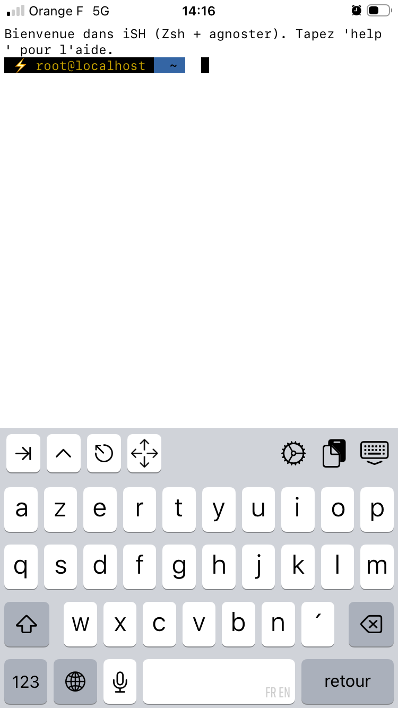

<p align="center">
	
</p>

## À propos de config-ish

**config-ish** est un fichier shell servant a configurer iSH.

## Fonctionnalités

Cette section est toujours en cours de rédaction.

## Installation

### Clonez le dépôt

````bash
git clone https://github.com/enioaiello/config-ish.git
````

### Rendre le fichier exécutable

````bash
cd config-ish/src
chmod +x ./setup.sh
````

### Lancer le script

````bash
./setup.sh
````

> [!NOTE]
> Vous pouvez également télécharger le script manuellement et le copier depuis l'application "Fichiers"

## Contribution

Toute contribution est bienvenue ! Vous pouvez utiliser ces moyens pour contribuer :
- Issues | Cliquez [ici](https://github.com/enioaiello/config-ish/issues)
- Pull Request | Cliquez [ici](https://github.com/enioaiello/config-ish/pulls)

## Soutiens

Si vous aimez ce projet, considérez à faire un don sur ma page [GitHub Sponsors](https://github.com/sponsors/enioaiello).

## Licence

Ce projet est distribué sous la licence MIT. Pour consulter cette licence, veuillez consulter le fichier [LICENSE](license).
